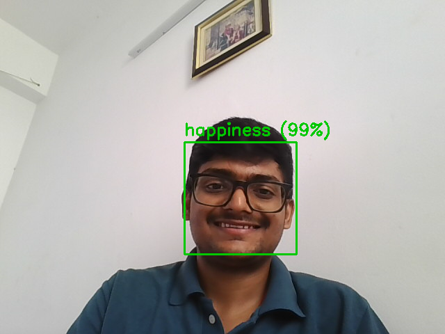
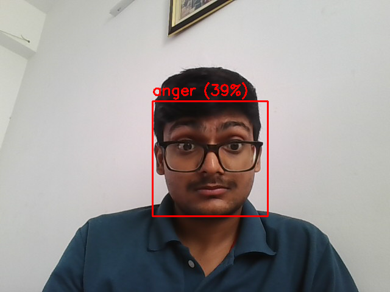
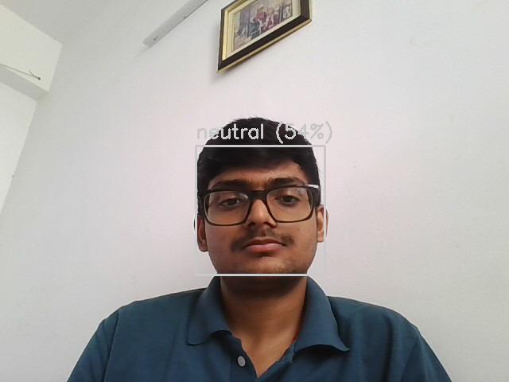

# 😊 Emotion Recognition — Comparative ML Study

A machine learning project that detects human faces in real-time and classifies their emotional expression, built to compare three different ML approaches — **KNN**, **CNN**, and **RNN (Bi-LSTM)** — head-to-head on the same dataset.

📂 **GitHub Repo:** https://github.com/Prince2004raj/emotion-recognition-ml

---

## 📌 About the Project

This project explores how well classical ML (KNN) stacks up against deep learning (CNN, RNN) on a real-world, imbalanced facial-emotion dataset. It covers the full pipeline — face detection, preprocessing, training three different model architectures, and a **live webcam demo** that detects your face and predicts your emotion in real time.

Built as a recreation of an academic project report, with all code, trained models, and results generated fresh and verified end-to-end.

## 🎥 Live Demo

<p align="center">
  
  
  
</p>

Run `06_live_webcam_demo.py` to try it yourself — it opens your webcam, draws a box around your face, and labels your predicted emotion live.

## ⚙️ Tech Stack

🔹 **Language:** Python

🔹 **Machine Learning / Deep Learning**
- scikit-learn (KNN)
- TensorFlow / Keras (CNN, Bi-LSTM)

🔹 **Computer Vision**
- OpenCV (Haar Cascade face detection, webcam capture)

🔹 **Data & Visualization**
- NumPy, Pandas
- Matplotlib

## ✨ Features

**🧠 Three ML Models Compared**
- K-Nearest Neighbours (pixel-based baseline)
- Convolutional Neural Network (spatial feature learning)
- Bidirectional LSTM (image rows treated as a sequence)

**👤 Face Detection**
- Haar Cascade frontal-face detector crops and aligns faces before classification

**📊 Full Evaluation Suite**
- Accuracy & macro F1 comparison charts
- Per-class precision/recall/F1
- Confusion matrices for all 3 models
- Training/validation curves

**📷 Real-Time Demo**
- Live webcam feed with bounding box + predicted emotion + confidence %

## 📈 Results Summary

| Model | Test Accuracy | Macro F1 |
|---|:---:|:---:|
| KNN (k=7) | 41.6% | 0.37 |
| **CNN** ⭐ | **58.8%** | **0.53** |
| RNN (Bi-LSTM) | 47.8% | 0.43 |

Full per-class metrics, confusion matrices, and training curves are in [`Results_and_Statistics.docx`](./Results_and_Statistics.docx).

## 🏗️ Project Structure

```
emotion-recognition-ml/
│
├── 01_data_prep.py          # Face crop (Haar Cascade), resize, class balancing, train/test split
├── 02_train_knn.py          # KNN baseline
├── 03_train_cnn.py          # CNN training
├── 04_train_rnn.py          # Bi-LSTM training
├── 05_make_visuals.py       # Charts, confusion matrices, screenshots
├── 06_live_webcam_demo.py   # Real-time webcam emotion detection
│
├── cnn_model.keras          # Trained CNN
├── rnn_model.keras          # Trained RNN
├── results_*.json           # Metrics for each model
│
├── figures/                 # Generated charts & confusion matrices
├── arrays/                  # Preprocessed train/test data (.npy)
├── demo_*.png                # Live demo screenshots
│
├── Results_and_Statistics.docx
└── README.md
```

## 🧠 Skills Demonstrated

**🤖 Machine Learning**
- Classical ML vs. Deep Learning comparison methodology
- Handling class imbalance (capping, class-weighted loss)
- Model evaluation beyond accuracy (macro F1, per-class metrics)

**👁️ Computer Vision**
- Haar Cascade face detection
- Image preprocessing pipelines (grayscale, resize, normalize)
- Real-time video frame processing with OpenCV

**🧬 Deep Learning**
- CNN architecture design (Conv/BatchNorm/Pool/Dropout)
- Sequence modeling with Bidirectional LSTM on non-standard (image) input
- Early stopping, class-weighted training

**📊 Data Analysis**
- Confusion matrices, training curves, comparative benchmarking
- Communicating results clearly with visualizations

## 🚀 Setup & Run

```bash
# 1. Clone this repo
git clone https://github.com/Prince2004raj/emotion-recognition-ml.git
cd emotion-recognition-ml

# 2. Install dependencies
pip install numpy pandas scikit-learn opencv-python tensorflow-cpu matplotlib

# 3. Get the dataset
git clone https://github.com/muxspace/facial_expressions.git facial_expressions-master

# 4. Run the pipeline in order
python 01_data_prep.py
python 02_train_knn.py
python 03_train_cnn.py
python 04_train_rnn.py
python 05_make_visuals.py

# 5. Try the live webcam demo
python 06_live_webcam_demo.py
```

## 📝 Notes / Honesty About Limitations

- Two of the original 8 emotion classes (**fear**, **contempt**) were dropped — too few samples (21 and 9 images) to split reliably.
- The RNN treats each image as 48 rows fed sequentially into an LSTM — a lightweight way to apply RNNs to *static* images (true video/temporal emotion data wasn't part of this dataset).
- Results are reproducible — all random seeds fixed at 42 throughout.

## 👤 Author

**Prince Raj**
📂 [GitHub](https://github.com/Prince2004raj)
